## I drew some line charts to show the tendency of the Execution time of different tasks by Scale Factors


```python
import pandas as pd
import matplotlib.pyplot as plt

# read CSV
df = pd.read_csv(r"C:\Users\Jintao1999\Desktop\ULB\data_warehouse\TPC-DI\result\results.csv")


plt.figure(figsize=(10, 6))
plt.plot(df['sf'], df['total'], marker='o') # column of csv

# add lable
for x, y in zip(df['sf'], df['total']):
    #plt.text(x, y, str(y))
    plt.text(x+0.1, y+100, str(y), va='bottom', ha='center')

# draw x and y
plt.xlabel('Scale Factors(SF)')
plt.ylabel('Execution Time(Sec)')
# just show the value of sf
plt.xticks(df['sf'])
# add titles
plt.title('Total Execution time by Scale Factors')

plt.ylim(0, max(df['total']) + 500) 

plt.show()

```


    
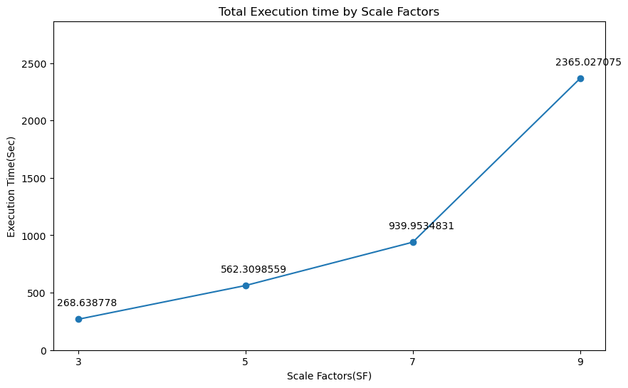
    


```python
import pandas as pd
import matplotlib.pyplot as plt

# read CSV
df = pd.read_csv(r"C:\Users\Jintao1999\Desktop\ULB\data_warehouse\TPC-DI\result\results.csv")

plt.figure(figsize=(10, 6))
plt.bar(df['sf'], df['total'], color='skyblue')  # Changed to bar chart

# add label
for x, y in zip(df['sf'], df['total']):
    plt.text(x, y+100, str(y), va='bottom', ha='center')

# draw x and y axes labels
plt.xlabel('Scale Factors(SF)')
plt.ylabel('Execution Time(Sec)')

# just show the value of sf on x-axis
plt.xticks(df['sf'])

# add title
plt.title('Total Execution time by Scale Factors')

# set y-axis limit
plt.ylim(0, max(df['total']) + 500) 

plt.show()

```


    
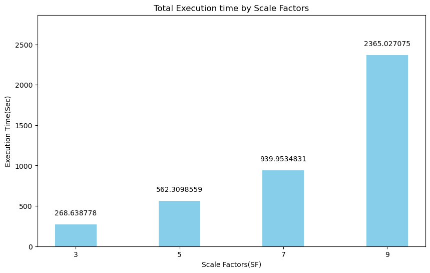
    


```python
import pandas as pd
import matplotlib.pyplot as plt


csv_file = (r"C:\Users\Jintao1999\Desktop\ULB\data_warehouse\TPC-DI\result\results.csv")


df = pd.read_csv(csv_file)


plt.figure(figsize=(10, 6))

# read columns from 1 to 31
columns = df.columns[1:31]

for col in columns:
    plt.plot(df['sf'], df[col], marker='o', label=col, linewidth=0.1,markersize=2)


plt.xlabel('Scale Factors(SF)')
plt.ylabel('Execution Time(Sec)')


plt.xticks(df['sf'])


plt.legend(loc='center left', bbox_to_anchor=(1, 0.5))


plt.title('Execution Time by Scale Factors for Various Missions')


plt.show()

```


    
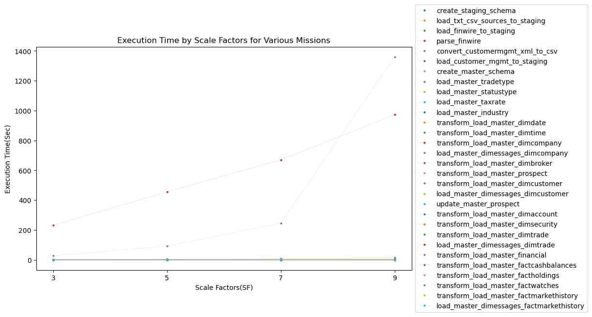
    


```python
import pandas as pd
import matplotlib.pyplot as plt


csv_file = (r"C:\Users\Jintao1999\Desktop\ULB\data_warehouse\TPC-DI\result\results.csv")


df = pd.read_csv(csv_file)


plt.figure(figsize=(10, 6))

##delete the largest two missions:parse_finwire,convert_customermgmt_xml_to_csv
columns = [col for i, col in enumerate(df.columns[1:31]) if i not in [3,4]]


for col in columns:
    plt.plot(df['sf'], df[col], marker='o', label=col, linewidth=0.1,markersize=2)

 


plt.xlabel('Scale Factors(SF)')
plt.ylabel('Execution Time(Sec)')


plt.xticks(df['sf'])


plt.legend(loc='center left', bbox_to_anchor=(1, 0.5))


plt.title('Execution Time by Scale Factors for Various Missions')


plt.show()

```


    
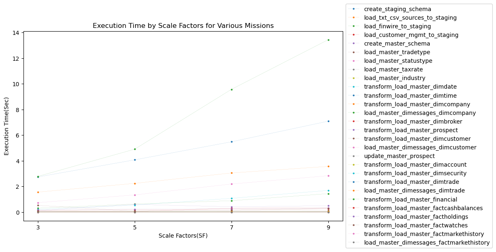
    


```python
import pandas as pd
import matplotlib.pyplot as plt


csv_file = (r"C:\Users\Jintao1999\Desktop\ULB\data_warehouse\TPC-DI\result\results.csv")


df = pd.read_csv(csv_file)


plt.figure(figsize=(10, 6))

##delete the largest eight missions:load_txt_csv_sources_to_staging,load_finwire_to_staging,parse_finwire,
#convert_customermgmt_xml_to_csv,transform_load_master_dimsecurity,transform_load_master_dimtrade
#transform_load_master_financial,transform_load_master_factmarkethistory
columns = [col for i, col in enumerate(df.columns[1:31]) if i not in [1,2,3,4,21,22,24,28]]


for col in columns:
    plt.plot(df['sf'], df[col], marker='o', label=col, linewidth=0.1,markersize=2)

  
plt.xlabel('Scale Factors(SF)')
plt.ylabel('Execution Time(Sec)')


plt.xticks(df['sf'])


plt.legend(loc='center left', bbox_to_anchor=(1, 0.5))


plt.title('Execution Time by Scale Factors for Various Missions')


plt.show()

```


    
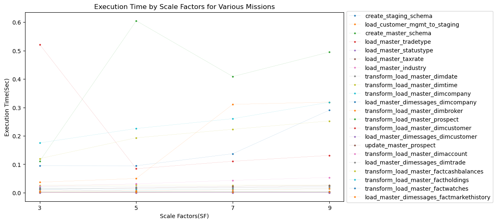
    


```python
import pandas as pd
import matplotlib.pyplot as plt

# read CSV
df = pd.read_csv(r"C:\Users\Jintao1999\Desktop\ULB\data_warehouse\TPC-DI\result\results.csv")


plt.figure(figsize=(10, 6))
plt.plot(df['sf'], df['create_staging_schema'], marker='o') # column of csv

# add lable
for x, y in zip(df['sf'], df['create_staging_schema']):
    #plt.text(x, y, str(y))
    plt.text(x+0.1, y+0.0001, str(y), va='bottom', ha='center')

# draw x and y
plt.xlabel('Scale Factors(SF)')
plt.ylabel('Execution Time(Sec)')
# just show the value of sf
plt.xticks(df['sf'])
# add titles
plt.title('Execution time of create_staging_schema by Scale Factors')

#plt.xlim(min(df['A']), max(df['A'])) 
#plt.ylim(0, max(df['load_txt_csv_sources_to_staging']) + 1) 


plt.show()

```


    
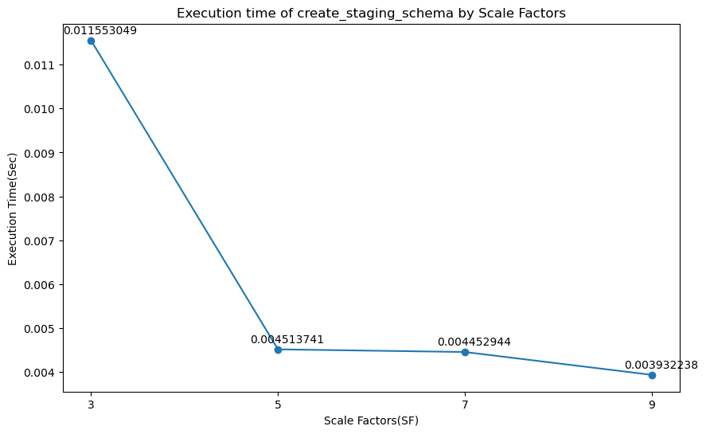
    


```python
import pandas as pd
import matplotlib.pyplot as plt

# read CSV
df = pd.read_csv(r"C:\Users\Jintao1999\Desktop\ULB\data_warehouse\TPC-DI\result\results.csv")

plt.figure(figsize=(10, 6))
plt.bar(df['sf'], df['create_staging_schema'], color='skyblue')  # Changed to bar chart

# add label
for x, y in zip(df['sf'], df['create_staging_schema']):
    plt.text(x, y, str(y), va='bottom', ha='center')

# draw x and y axes labels
plt.xlabel('Scale Factors(SF)')
plt.ylabel('Execution Time(Sec)')

# just show the value of sf on x-axis
plt.xticks(df['sf'])

# add title
plt.title('Execution time of create_staging_schema by Scale Factors')

# set y-axis limit
plt.ylim(0, max(df['create_staging_schema']) + 0.003) 

plt.show()

```


    
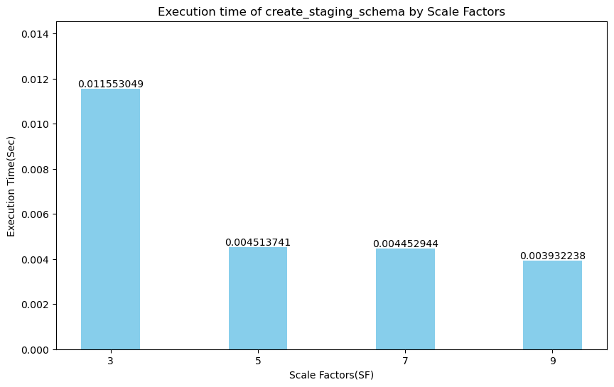
    


```python
import pandas as pd
import matplotlib.pyplot as plt

# read CSV
df = pd.read_csv(r"C:\Users\Jintao1999\Desktop\ULB\data_warehouse\TPC-DI\result\results.csv")


plt.figure(figsize=(10, 6))
plt.plot(df['sf'], df['load_txt_csv_sources_to_staging'], marker='o') # column of csv

# add lable
for x, y in zip(df['sf'], df['load_txt_csv_sources_to_staging']):
    plt.text(x+0.1, y+0.1, str(y), va='bottom', ha='center')


# draw x and y
plt.xlabel('Scale Factors(SF)')
plt.ylabel('Execution Time(Sec)')
# just show the value of sf
plt.xticks(df['sf'])
# add titles
plt.title('Execution time of load_txt_csv_sources_to_staging by Scale Factors')

#plt.xlim(min(df['A']), max(df['A'])) 
plt.ylim(0, max(df['load_txt_csv_sources_to_staging']) + 0.5) 


plt.show()

```


    
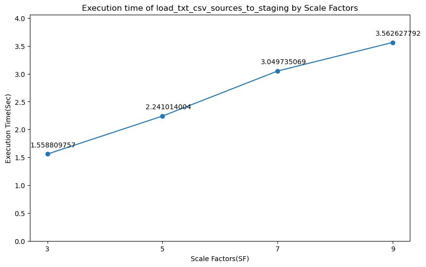
    


```python
import pandas as pd
import matplotlib.pyplot as plt

# read CSV
df = pd.read_csv(r"C:\Users\Jintao1999\Desktop\ULB\data_warehouse\TPC-DI\result\results.csv")

plt.figure(figsize=(10, 6))
plt.bar(df['sf'], df['load_txt_csv_sources_to_staging'], color='skyblue')  # Changed to bar chart

# add label
for x, y in zip(df['sf'], df['load_txt_csv_sources_to_staging']):
    plt.text(x, y, str(y), va='bottom', ha='center')

# draw x and y axes labels
plt.xlabel('Scale Factors(SF)')
plt.ylabel('Execution Time(Sec)')

# just show the value of sf on x-axis
plt.xticks(df['sf'])

# add title
plt.title('Execution time of load_txt_csv_sources_to_staging by Scale Factors')

# set y-axis limit
plt.ylim(0, max(df['load_txt_csv_sources_to_staging']) + 0.3) 

plt.show()

```


    
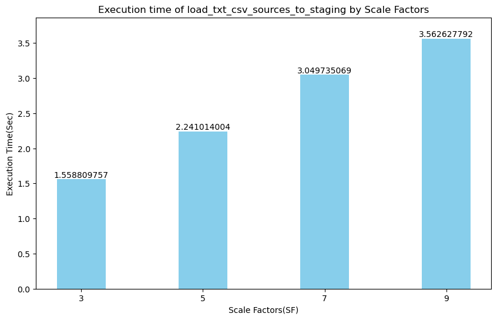
    


```python
import pandas as pd
import matplotlib.pyplot as plt

# read CSV
df = pd.read_csv(r"C:\Users\Jintao1999\Desktop\ULB\data_warehouse\TPC-DI\result\results.csv")


plt.figure(figsize=(10, 6))
plt.plot(df['sf'], df['load_finwire_to_staging'], marker='o') # column of csv

# add lable
for x, y in zip(df['sf'], df['load_finwire_to_staging']):
    plt.text(x+0.1, y+0.05, str(y), va='bottom', ha='center')


# draw x and y
plt.xlabel('Scale Factors(SF)')
plt.ylabel('Execution Time(Sec)')
# just show the value of sf
plt.xticks(df['sf'])
# add titles
plt.title('Execution time of load_finwire_to_staging by Scale Factors')

#plt.xlim(min(df['A']), max(df['A'])) 
plt.ylim(0, max(df['load_finwire_to_staging']) + 0.25) 


plt.show()

```


    
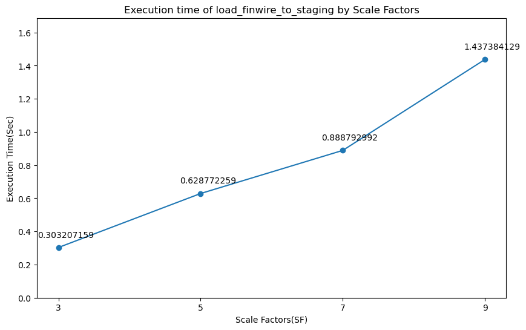
    


```python
import pandas as pd
import matplotlib.pyplot as plt

# read CSV
df = pd.read_csv(r"C:\Users\Jintao1999\Desktop\ULB\data_warehouse\TPC-DI\result\results.csv")

plt.figure(figsize=(10, 6))
plt.bar(df['sf'], df['load_finwire_to_staging'], color='skyblue')  # Changed to bar chart

# add label
for x, y in zip(df['sf'], df['load_finwire_to_staging']):
    plt.text(x, y, str(y), va='bottom', ha='center')

# draw x and y axes labels
plt.xlabel('Scale Factors(SF)')
plt.ylabel('Execution Time(Sec)')

# just show the value of sf on x-axis
plt.xticks(df['sf'])

# add title
plt.title('Execution time of load_finwire_to_staging by Scale Factors')

# set y-axis limit
plt.ylim(0, max(df['load_finwire_to_staging']) + 0.05) 

plt.show()

```


    
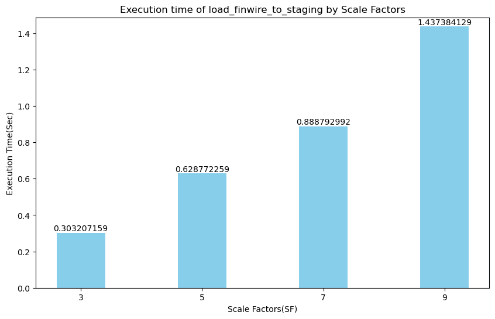
    


```python
import pandas as pd
import matplotlib.pyplot as plt

# read CSV
df = pd.read_csv(r"C:\Users\Jintao1999\Desktop\ULB\data_warehouse\TPC-DI\result\results.csv")


plt.figure(figsize=(10, 6))
plt.plot(df['sf'], df['parse_finwire'], marker='o') # column of csv

# add lable
for x, y in zip(df['sf'], df['parse_finwire']):
    plt.text(x+0.1, y+15, str(y), va='bottom', ha='center')


# draw x and y
plt.xlabel('Scale Factors(SF)')
plt.ylabel('Execution Time(Sec)')
# just show the value of sf
plt.xticks(df['sf'])
# add titles
plt.title('Execution time of parse_finwire by Scale Factors')

#plt.xlim(min(df['A']), max(df['A'])) 
plt.ylim(0, max(df['parse_finwire']) + 100) 


plt.show()

```


    
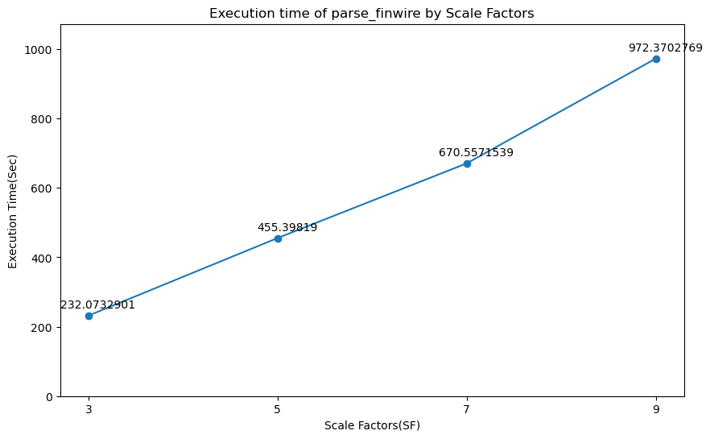
    


```python
import pandas as pd
import matplotlib.pyplot as plt

# read CSV
df = pd.read_csv(r"C:\Users\Jintao1999\Desktop\ULB\data_warehouse\TPC-DI\result\results.csv")

plt.figure(figsize=(10, 6))
plt.bar(df['sf'], df['parse_finwire'], color='skyblue')  # Changed to bar chart

# add label
for x, y in zip(df['sf'], df['parse_finwire']):
    plt.text(x, y, str(y), va='bottom', ha='center')

# draw x and y axes labels
plt.xlabel('Scale Factors(SF)')
plt.ylabel('Execution Time(Sec)')

# just show the value of sf on x-axis
plt.xticks(df['sf'])

# add title
plt.title('Execution time of parse_finwire by Scale Factors')

# set y-axis limit
plt.ylim(0, max(df['parse_finwire']) + 50) 

plt.show()

```


    
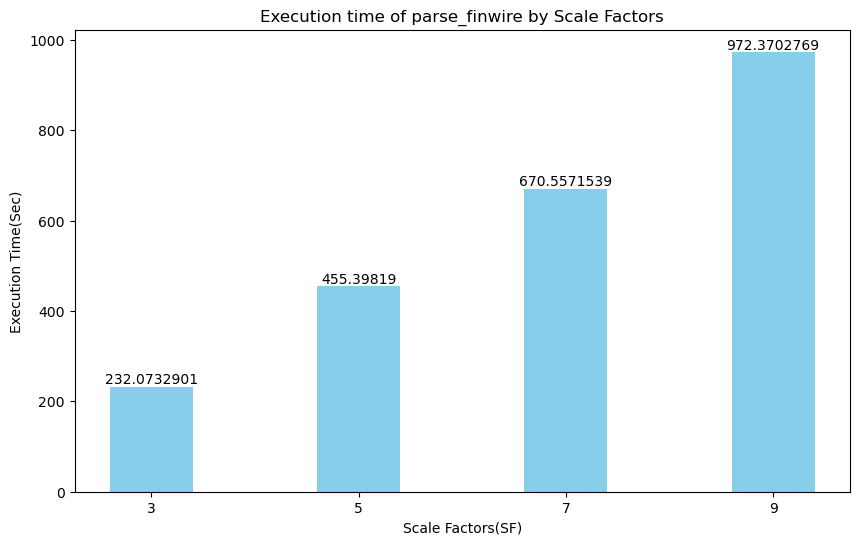
    


```python
import pandas as pd
import matplotlib.pyplot as plt

# read CSV
df = pd.read_csv(r"C:\Users\Jintao1999\Desktop\ULB\data_warehouse\TPC-DI\result\results.csv")


plt.figure(figsize=(10, 6))
plt.plot(df['sf'], df['convert_customermgmt_xml_to_csv'], marker='o') # column of csv

# add lable
for x, y in zip(df['sf'], df['convert_customermgmt_xml_to_csv']):
    plt.text(x+0.1, y+15, str(y), va='bottom', ha='center')


# draw x and y
plt.xlabel('Scale Factors(SF)')
plt.ylabel('Execution Time(Sec)')
# just show the value of sf
plt.xticks(df['sf'])
# add titles
plt.title('Execution time of convert_customermgmt_xml_to_csv by Scale Factors')

#plt.xlim(0, max(df['convert_customermgmt_xml_to_csv']) + 1) 
plt.ylim(0, max(df['convert_customermgmt_xml_to_csv']) + 100) 


plt.show()

```


    
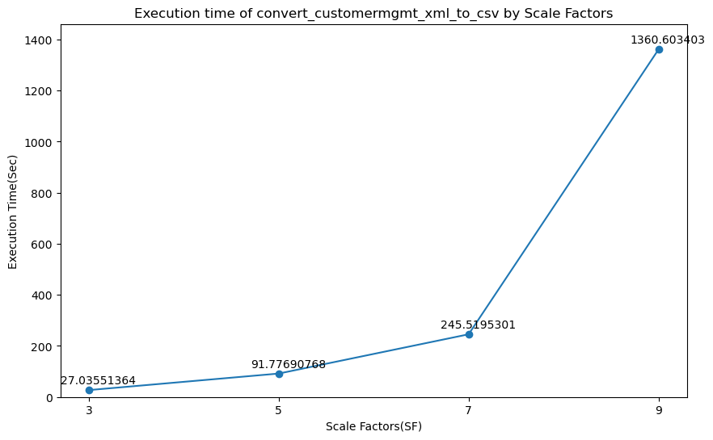
    


```python
import pandas as pd
import matplotlib.pyplot as plt

# read CSV
df = pd.read_csv(r"C:\Users\Jintao1999\Desktop\ULB\data_warehouse\TPC-DI\result\results.csv")

plt.figure(figsize=(10, 6))
plt.bar(df['sf'], df['convert_customermgmt_xml_to_csv'], color='skyblue')  # Changed to bar chart

# add label
for x, y in zip(df['sf'], df['convert_customermgmt_xml_to_csv']):
    plt.text(x, y, str(y), va='bottom', ha='center')

# draw x and y axes labels
plt.xlabel('Scale Factors(SF)')
plt.ylabel('Execution Time(Sec)')

# just show the value of sf on x-axis
plt.xticks(df['sf'])

# add title
plt.title('Execution time of convert_customermgmt_xml_to_csv by Scale Factors')

# set y-axis limit
plt.ylim(0, max(df['convert_customermgmt_xml_to_csv']) + 50) 

plt.show()

```


    
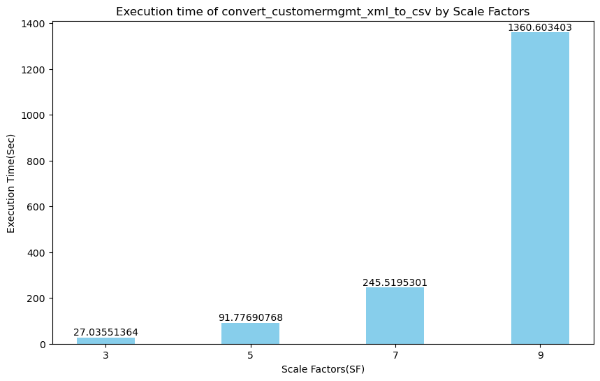
    


```python
import pandas as pd
import matplotlib.pyplot as plt

# read CSV
df = pd.read_csv(r"C:\Users\Jintao1999\Desktop\ULB\data_warehouse\TPC-DI\result\results.csv")


plt.figure(figsize=(10, 6))
plt.plot(df['sf'], df['load_customer_mgmt_to_staging'], marker='o') # column of csv

# add lable
for x, y in zip(df['sf'], df['load_customer_mgmt_to_staging']):
    plt.text(x+0.1, y+0.005, str(y), va='bottom', ha='center')


# draw x and y
plt.xlabel('Scale Factors(SF)')
plt.ylabel('Execution Time(Sec)')
# just show the value of sf
plt.xticks(df['sf'])
# add titles
plt.title('Execution time of load_customer_mgmt_to_staging by Scale Factors')

#plt.xlim(0, max(df['convert_customermgmt_xml_to_csv']) + 1) 
plt.ylim(0, max(df['load_customer_mgmt_to_staging']) + 0.05) 


plt.show()

```


    
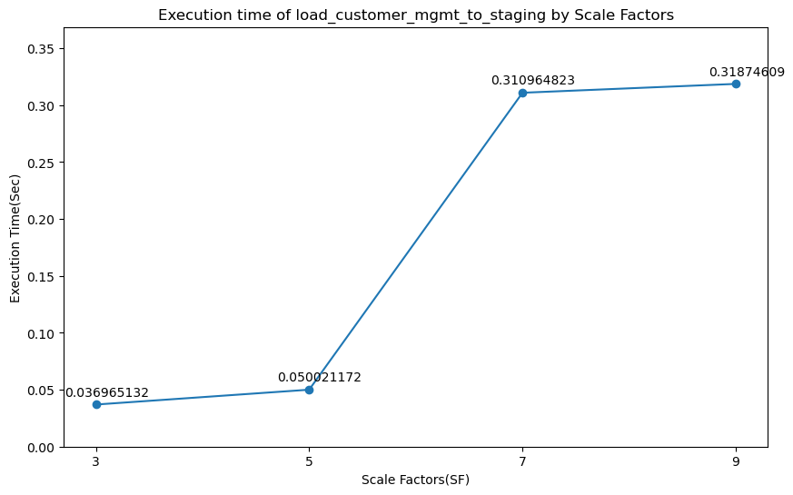
    


```python
import pandas as pd
import matplotlib.pyplot as plt

# read CSV
df = pd.read_csv(r"C:\Users\Jintao1999\Desktop\ULB\data_warehouse\TPC-DI\result\results.csv")


plt.figure(figsize=(10, 6))
plt.plot(df['sf'], df['create_master_schema'], marker='o') # column of csv

# add lable
for x, y in zip(df['sf'], df['create_master_schema']):
    plt.text(x+0.1, y+0.0001, str(y), va='bottom', ha='center')


# draw x and y
plt.xlabel('Scale Factors(SF)')
plt.ylabel('Execution Time(Sec)')
# just show the value of sf
plt.xticks(df['sf'])
# add titles
plt.title('Execution time of create_master_schema by Scale Factors')

#plt.xlim(0, max(df['convert_customermgmt_xml_to_csv']) + 1) 
plt.ylim(0, max(df['create_master_schema']) + 0.001) 


plt.show()

```


    
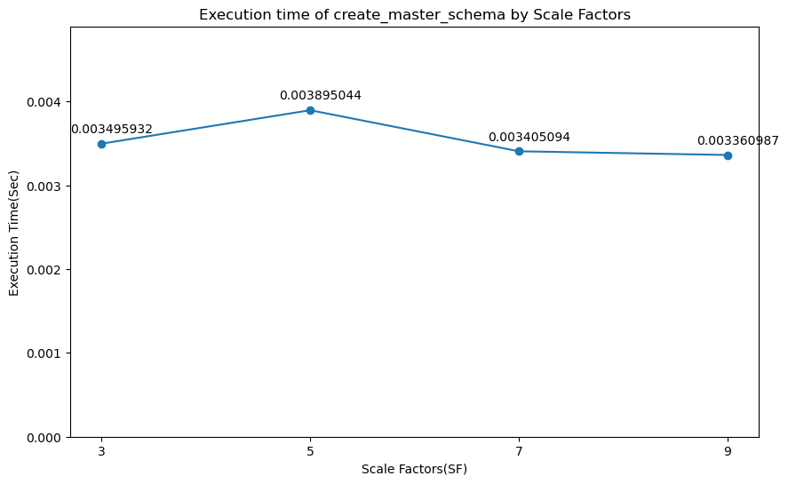
    


```python
import pandas as pd
import matplotlib.pyplot as plt

# read CSV
df = pd.read_csv(r"C:\Users\Jintao1999\Desktop\ULB\data_warehouse\TPC-DI\result\results.csv")

plt.figure(figsize=(10, 6))
plt.bar(df['sf'], df['create_master_schema'], color='skyblue')  # Changed to bar chart

# add label
for x, y in zip(df['sf'], df['create_master_schema']):
    plt.text(x, y, str(y), va='bottom', ha='center')

# draw x and y axes labels
plt.xlabel('Scale Factors(SF)')
plt.ylabel('Execution Time(Sec)')

# just show the value of sf on x-axis
plt.xticks(df['sf'])

# add title
plt.title('Execution time of create_master_schema by Scale Factors')

# set y-axis limit
plt.ylim(0, max(df['create_master_schema']) + 0.0005) 

plt.show()

```


    
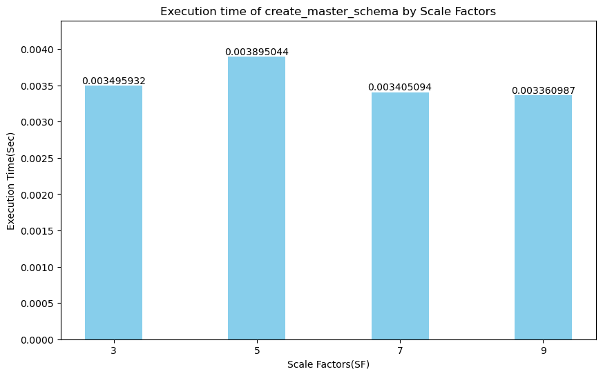
    


```python
import pandas as pd
import matplotlib.pyplot as plt

# read CSV
df = pd.read_csv(r"C:\Users\Jintao1999\Desktop\ULB\data_warehouse\TPC-DI\result\results.csv")


plt.figure(figsize=(10, 6))
plt.plot(df['sf'], df['load_master_tradetype'], marker='o') # column of csv

# add lable
for x, y in zip(df['sf'], df['load_master_tradetype']):
    plt.text(x+0.1, y+0.00001, str(y), va='bottom', ha='center')


# draw x and y
plt.xlabel('Scale Factors(SF)')
plt.ylabel('Execution Time(Sec)')
# just show the value of sf
plt.xticks(df['sf'])
# add titles
plt.title('Execution time of load_master_tradetype by Scale Factors')

#plt.xlim(0, max(df['convert_customermgmt_xml_to_csv']) + 1) 
plt.ylim(0, max(df['load_master_tradetype']) + 0.0001) 


plt.show()

```


    
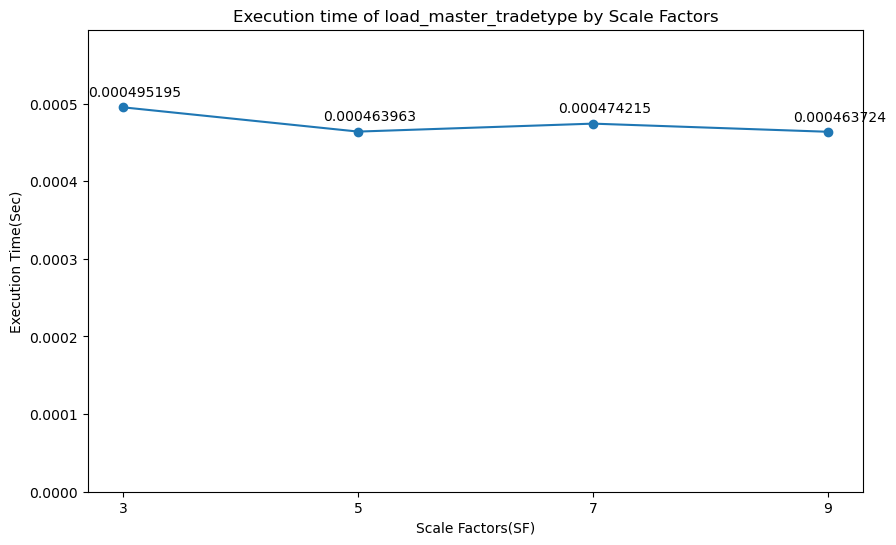
    


```python
import pandas as pd
import matplotlib.pyplot as plt

# read CSV
df = pd.read_csv(r"C:\Users\Jintao1999\Desktop\ULB\data_warehouse\TPC-DI\result\results.csv")

plt.figure(figsize=(10, 6))
plt.bar(df['sf'], df['load_master_tradetype'], color='skyblue')  # Changed to bar chart

# add label
for x, y in zip(df['sf'], df['load_master_tradetype']):
    plt.text(x, y, str(y), va='bottom', ha='center')

# draw x and y axes labels
plt.xlabel('Scale Factors(SF)')
plt.ylabel('Execution Time(Sec)')

# just show the value of sf on x-axis
plt.xticks(df['sf'])

# add title
plt.title('Execution time of load_master_tradetype by Scale Factors')

# set y-axis limit
plt.ylim(0, max(df['load_master_tradetype']) + 0.00005) 

plt.show()

```


    
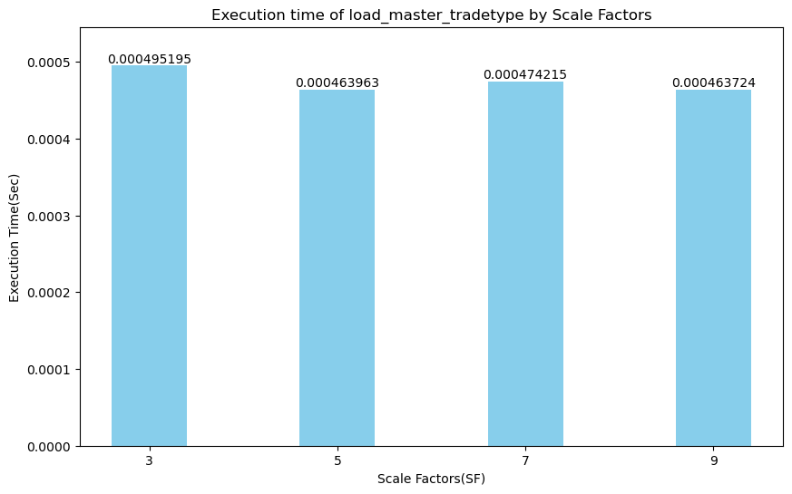
    


```python
import pandas as pd
import matplotlib.pyplot as plt

# read CSV
df = pd.read_csv(r"C:\Users\Jintao1999\Desktop\ULB\data_warehouse\TPC-DI\result\results.csv")


plt.figure(figsize=(10, 6))
plt.plot(df['sf'], df['load_master_statustype'], marker='o') # column of csv

# add lable
for x, y in zip(df['sf'], df['load_master_statustype']):
    plt.text(x+0.1, y+0.00001, str(y), va='bottom', ha='center')


# draw x and y
plt.xlabel('Scale Factors(SF)')
plt.ylabel('Execution Time(Sec)')
# just show the value of sf
plt.xticks(df['sf'])
# add titles
plt.title('Execution time of load_master_statustype by Scale Factors')

#plt.xlim(0, max(df['convert_customermgmt_xml_to_csv']) + 1) 
plt.ylim(0, max(df['load_master_statustype']) + 0.0001) 


plt.show()

```


    
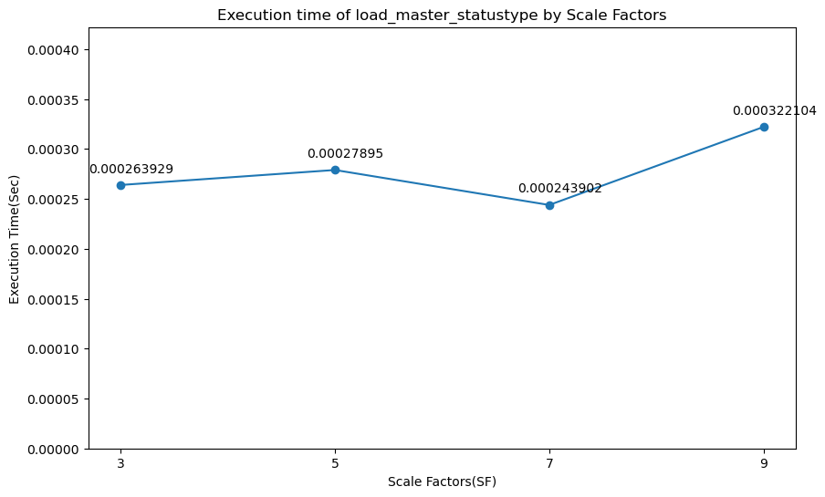
    


```python
import pandas as pd
import matplotlib.pyplot as plt

# read CSV
df = pd.read_csv(r"C:\Users\Jintao1999\Desktop\ULB\data_warehouse\TPC-DI\result\results.csv")

plt.figure(figsize=(10, 6))
plt.bar(df['sf'], df['load_master_statustype'], color='skyblue')  # Changed to bar chart

# add label
for x, y in zip(df['sf'], df['load_master_statustype']):
    plt.text(x, y, str(y), va='bottom', ha='center')

# draw x and y axes labels
plt.xlabel('Scale Factors(SF)')
plt.ylabel('Execution Time(Sec)')

# just show the value of sf on x-axis
plt.xticks(df['sf'])

# add title
plt.title('Execution time of load_master_statustype by Scale Factors')

# set y-axis limit
plt.ylim(0, max(df['load_master_statustype']) + 0.00005) 

plt.show()

```


    
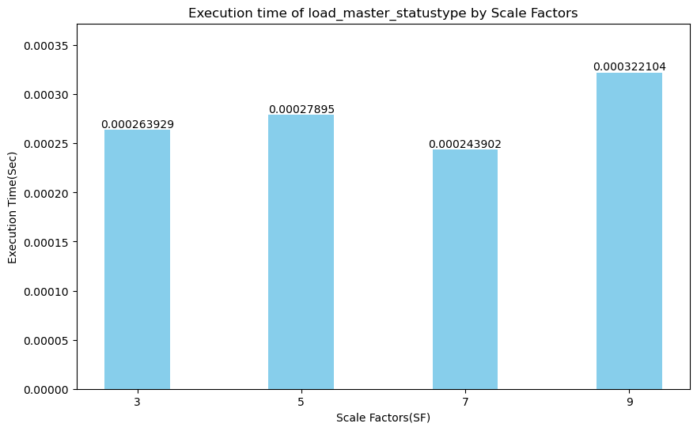
    


```python
import pandas as pd
import matplotlib.pyplot as plt

# read CSV
df = pd.read_csv(r"C:\Users\Jintao1999\Desktop\ULB\data_warehouse\TPC-DI\result\results.csv")


plt.figure(figsize=(10, 6))
plt.plot(df['sf'], df['load_master_taxrate'], marker='o') # column of csv

# add lable
for x, y in zip(df['sf'], df['load_master_taxrate']):
    plt.text(x+0.1, y+0.00001, str(y), va='bottom', ha='center')


# draw x and y
plt.xlabel('Scale Factors(SF)')
plt.ylabel('Execution Time(Sec)')
# just show the value of sf
plt.xticks(df['sf'])
# add titles
plt.title('Execution time of load_master_taxrate by Scale Factors')

#plt.xlim(0, max(df['convert_customermgmt_xml_to_csv']) + 1) 
plt.ylim(0, max(df['load_master_taxrate']) + 0.0001) 


plt.show()

```


    
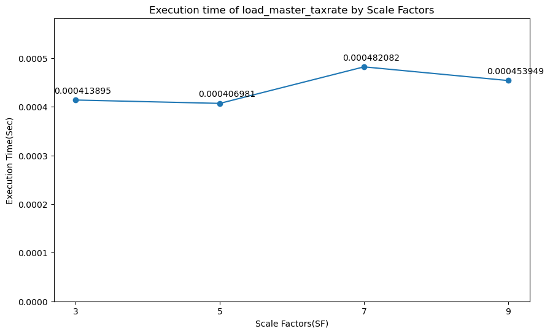
    


```python
import pandas as pd
import matplotlib.pyplot as plt

# read CSV
df = pd.read_csv(r"C:\Users\Jintao1999\Desktop\ULB\data_warehouse\TPC-DI\result\results.csv")


plt.figure(figsize=(10, 6))
plt.plot(df['sf'], df['load_master_industry'], marker='o') # column of csv

# add lable
for x, y in zip(df['sf'], df['load_master_industry']):
    plt.text(x+0.1, y+0.00001, str(y), va='bottom', ha='center')


# draw x and y
plt.xlabel('Scale Factors(SF)')
plt.ylabel('Execution Time(Sec)')
# just show the value of sf
plt.xticks(df['sf'])
# add titles
plt.title('Execution time of load_master_industry by Scale Factors')

#plt.xlim(0, max(df['convert_customermgmt_xml_to_csv']) + 1) 
plt.ylim(0, max(df['load_master_industry']) + 0.0001) 


plt.show()

```


    
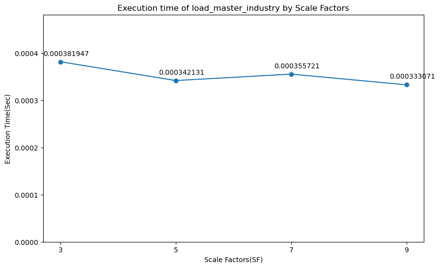
    


```python
import pandas as pd
import matplotlib.pyplot as plt

# read CSV
df = pd.read_csv(r"C:\Users\Jintao1999\Desktop\ULB\data_warehouse\TPC-DI\result\results.csv")


plt.figure(figsize=(10, 6))
plt.plot(df['sf'], df['transform_load_master_dimdate'], marker='o') # column of csv

# add lable
for x, y in zip(df['sf'], df['transform_load_master_dimdate']):
    plt.text(x+0.1, y+0.00001, str(y), va='bottom', ha='center')


# draw x and y
plt.xlabel('Scale Factors(SF)')
plt.ylabel('Execution Time(Sec)')
# just show the value of sf
plt.xticks(df['sf'])
# add titles
plt.title('Execution time of transform_load_master_dimdate by Scale Factors')

#plt.xlim(0, max(df['convert_customermgmt_xml_to_csv']) + 1) 
plt.ylim(0, max(df['transform_load_master_dimdate']) + 0.005) 


plt.show()

```


    
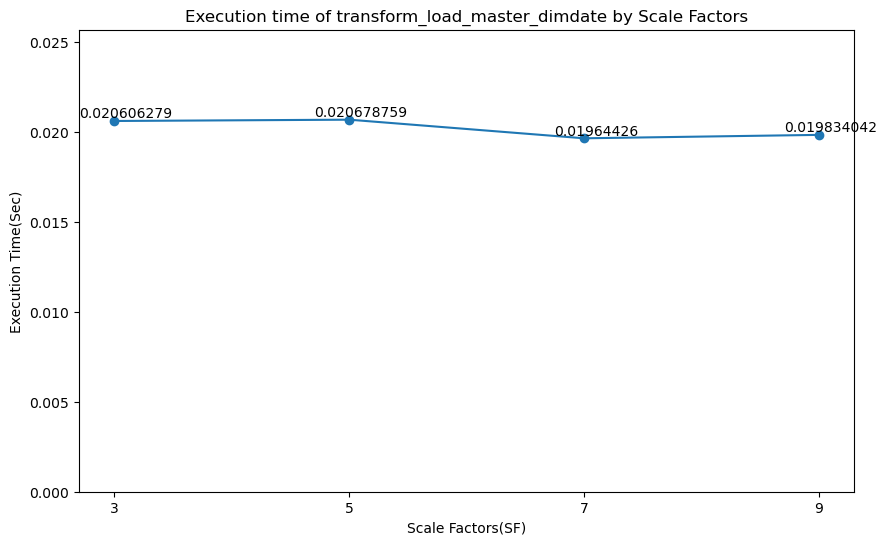
    


```python
import pandas as pd
import matplotlib.pyplot as plt

# read CSV
df = pd.read_csv(r"C:\Users\Jintao1999\Desktop\ULB\data_warehouse\TPC-DI\result\results.csv")

plt.figure(figsize=(10, 6))
plt.bar(df['sf'], df['transform_load_master_dimdate'], color='skyblue')  # Changed to bar chart

# add label
for x, y in zip(df['sf'], df['transform_load_master_dimdate']):
    plt.text(x, y, str(y), va='bottom', ha='center')

# draw x and y axes labels
plt.xlabel('Scale Factors(SF)')
plt.ylabel('Execution Time(Sec)')

# just show the value of sf on x-axis
plt.xticks(df['sf'])

# add title
plt.title('Execution time of transform_load_master_dimdate by Scale Factors')

# set y-axis limit
plt.ylim(0, max(df['transform_load_master_dimdate']) + 0.005) 

plt.show()

```


    
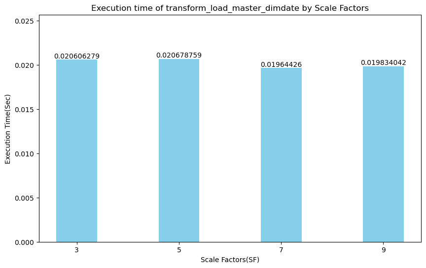
    


```python
import pandas as pd
import matplotlib.pyplot as plt

# read CSV
df = pd.read_csv(r"C:\Users\Jintao1999\Desktop\ULB\data_warehouse\TPC-DI\result\results.csv")


plt.figure(figsize=(10, 6))
plt.plot(df['sf'], df['transform_load_master_dimtime'], marker='o') # column of csv

# add lable
for x, y in zip(df['sf'], df['transform_load_master_dimtime']):
    plt.text(x+0.1, y+0.00001, str(y), va='bottom', ha='center')


# draw x and y
plt.xlabel('Scale Factors(SF)')
plt.ylabel('Execution Time(Sec)')
# just show the value of sf
plt.xticks(df['sf'])
# add titles
plt.title('Execution time of transform_load_master_dimtime by Scale Factors')

#plt.xlim(0, max(df['convert_customermgmt_xml_to_csv']) + 1) 
plt.ylim(0, max(df['transform_load_master_dimtime']) + 0.005) 


plt.show()

```


    
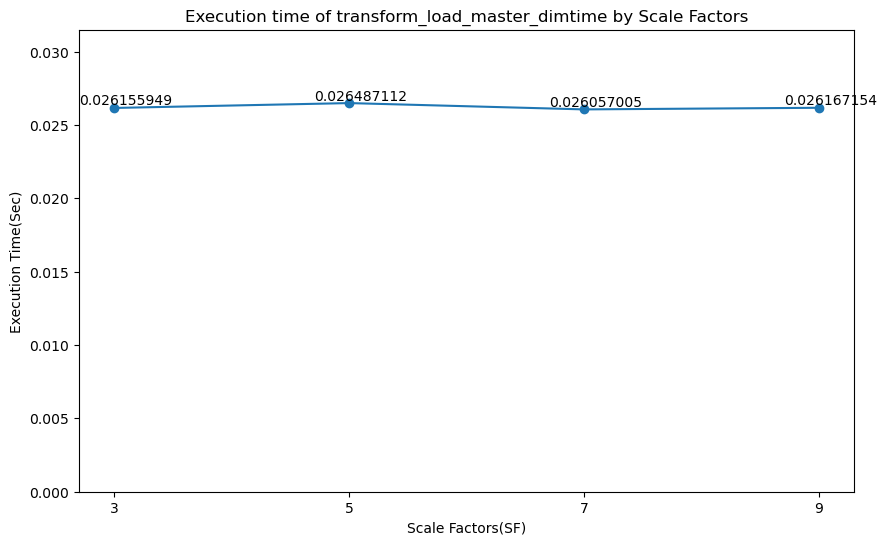
    


```python
import pandas as pd
import matplotlib.pyplot as plt

# read CSV
df = pd.read_csv(r"C:\Users\Jintao1999\Desktop\ULB\data_warehouse\TPC-DI\result\results.csv")


plt.figure(figsize=(10, 6))
plt.plot(df['sf'], df['transform_load_master_dimcompany'], marker='o') # column of csv

# add lable
for x, y in zip(df['sf'], df['transform_load_master_dimcompany']):
    plt.text(x+0.1, y+0.00001, str(y), va='bottom', ha='center')


# draw x and y
plt.xlabel('Scale Factors(SF)')
plt.ylabel('Execution Time(Sec)')
# just show the value of sf
plt.xticks(df['sf'])
# add titles
plt.title('Execution time of transform_load_master_dimcompany by Scale Factors')

#plt.xlim(0, max(df['convert_customermgmt_xml_to_csv']) + 1) 
plt.ylim(0, max(df['transform_load_master_dimcompany']) + 0.002) 


plt.show()

```


    
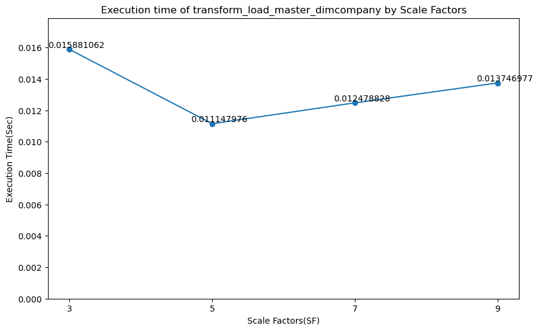
    


```python
import pandas as pd
import matplotlib.pyplot as plt

# read CSV
df = pd.read_csv(r"C:\Users\Jintao1999\Desktop\ULB\data_warehouse\TPC-DI\result\results.csv")


plt.figure(figsize=(10, 6))
plt.plot(df['sf'], df['load_master_dimessages_dimcompany'], marker='o') # column of csv

# add lable
for x, y in zip(df['sf'], df['load_master_dimessages_dimcompany']):
    plt.text(x+0.1, y+0.00001, str(y), va='bottom', ha='center')


# draw x and y
plt.xlabel('Scale Factors(SF)')
plt.ylabel('Execution Time(Sec)')
# just show the value of sf
plt.xticks(df['sf'])
# add titles
plt.title('Execution time of load_master_dimessages_dimcompany by Scale Factors')

#plt.xlim(0, max(df['convert_customermgmt_xml_to_csv']) + 1) 
plt.ylim(0, max(df['load_master_dimessages_dimcompany']) + 0.0003) 


plt.show()

```


    
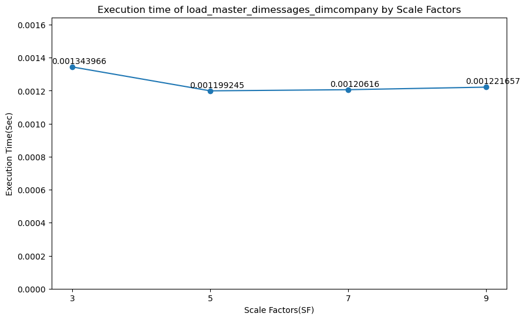
    


```python
import pandas as pd
import matplotlib.pyplot as plt

# read CSV
df = pd.read_csv(r"C:\Users\Jintao1999\Desktop\ULB\data_warehouse\TPC-DI\result\results.csv")


plt.figure(figsize=(10, 6))
plt.plot(df['sf'], df['transform_load_master_dimbroker'], marker='o') # column of csv

# add lable
for x, y in zip(df['sf'], df['transform_load_master_dimbroker']):
    plt.text(x+0.1, y+0.0001, str(y), va='bottom', ha='center')


# draw x and y
plt.xlabel('Scale Factors(SF)')
plt.ylabel('Execution Time(Sec)')
# just show the value of sf
plt.xticks(df['sf'])
# add titles
plt.title('Execution time of transform_load_master_dimbroker by Scale Factors')

#plt.xlim(0, max(df['convert_customermgmt_xml_to_csv']) + 1) 
plt.ylim(0, max(df['transform_load_master_dimbroker']) + 0.0008) 


plt.show()

```


    
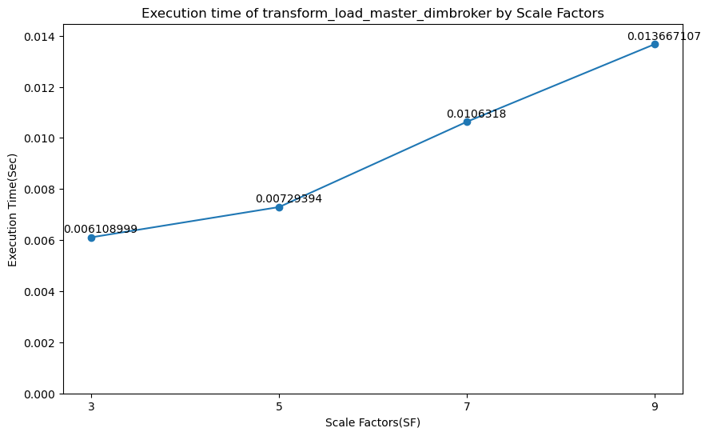
    


```python
import pandas as pd
import matplotlib.pyplot as plt

# read CSV
df = pd.read_csv(r"C:\Users\Jintao1999\Desktop\ULB\data_warehouse\TPC-DI\result\results.csv")


plt.figure(figsize=(10, 6))
plt.plot(df['sf'], df['transform_load_master_prospect'], marker='o') # column of csv

# add lable
for x, y in zip(df['sf'], df['transform_load_master_prospect']):
    plt.text(x+0.1, y+0.002, str(y), va='bottom', ha='center')


# draw x and y
plt.xlabel('Scale Factors(SF)')
plt.ylabel('Execution Time(Sec)')
# just show the value of sf
plt.xticks(df['sf'])
# add titles
plt.title('Execution time of transform_load_master_prospect by Scale Factors')

#plt.xlim(0, max(df['convert_customermgmt_xml_to_csv']) + 1) 
plt.ylim(0, max(df['transform_load_master_prospect']) + 0.08) 


plt.show()

```


    
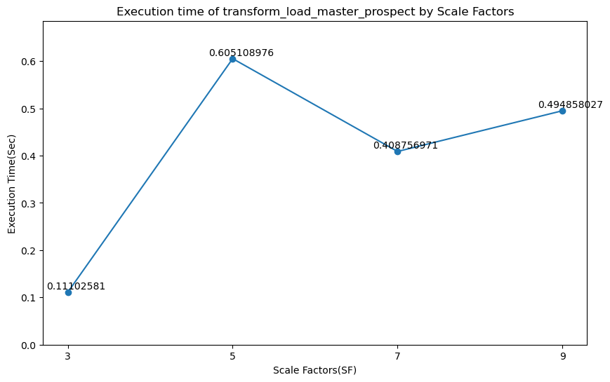
    


```python
import pandas as pd
import matplotlib.pyplot as plt

# read CSV
df = pd.read_csv(r"C:\Users\Jintao1999\Desktop\ULB\data_warehouse\TPC-DI\result\results.csv")


plt.figure(figsize=(10, 6))
plt.plot(df['sf'], df['transform_load_master_dimcustomer'], marker='o') # column of csv

# add lable
for x, y in zip(df['sf'], df['transform_load_master_dimcustomer']):
    plt.text(x+0.1, y+0.02, str(y), va='bottom', ha='center')


# draw x and y
plt.xlabel('Scale Factors(SF)')
plt.ylabel('Execution Time(Sec)')
# just show the value of sf
plt.xticks(df['sf'])
# add titles
plt.title('Execution time of transform_load_master_dimcustomer by Scale Factors')

#plt.xlim(0, max(df['convert_customermgmt_xml_to_csv']) + 1) 
plt.ylim(0, max(df['transform_load_master_dimcustomer']) + 0.08) 


plt.show()

```


    
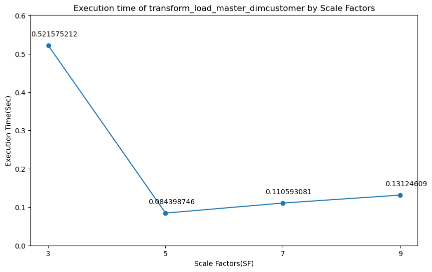
    


```python
import pandas as pd
import matplotlib.pyplot as plt

# read CSV
df = pd.read_csv(r"C:\Users\Jintao1999\Desktop\ULB\data_warehouse\TPC-DI\result\results.csv")


plt.figure(figsize=(10, 6))
plt.plot(df['sf'], df['load_master_dimessages_dimcustomer'], marker='o') # column of csv

# add lable
for x, y in zip(df['sf'], df['load_master_dimessages_dimcustomer']):
    plt.text(x+0.1, y+0.0002, str(y), va='bottom', ha='center')


# draw x and y
plt.xlabel('Scale Factors(SF)')
plt.ylabel('Execution Time(Sec)')
# just show the value of sf
plt.xticks(df['sf'])
# add titles
plt.title('Execution time of load_master_dimessages_dimcustomer by Scale Factors')

#plt.xlim(0, max(df['convert_customermgmt_xml_to_csv']) + 1) 
plt.ylim(0, max(df['load_master_dimessages_dimcustomer']) + 0.0005) 


plt.show()

```


    
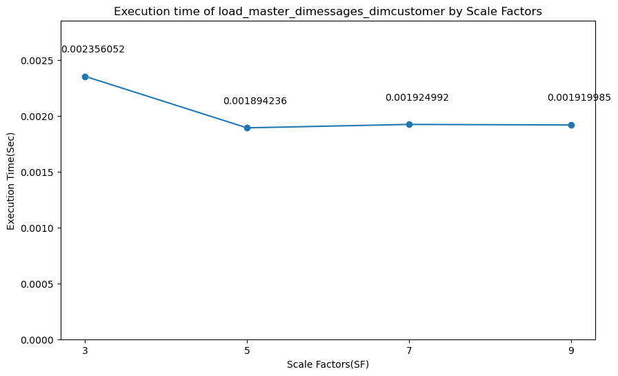
    


```python
import pandas as pd
import matplotlib.pyplot as plt

# read CSV
df = pd.read_csv(r"C:\Users\Jintao1999\Desktop\ULB\data_warehouse\TPC-DI\result\results.csv")


plt.figure(figsize=(10, 6))
plt.plot(df['sf'], df['update_master_prospect'], marker='o') # column of csv

# add lable
for x, y in zip(df['sf'], df['update_master_prospect']):
    plt.text(x+0.1, y+0.002, str(y), va='bottom', ha='center')


# draw x and y
plt.xlabel('Scale Factors(SF)')
plt.ylabel('Execution Time(Sec)')
# just show the value of sf
plt.xticks(df['sf'])
# add titles
plt.title('Execution time of update_master_prospect by Scale Factors')

#plt.xlim(0, max(df['convert_customermgmt_xml_to_csv']) + 1) 
plt.ylim(0, max(df['update_master_prospect']) + 0.005) 


plt.show()

```


    
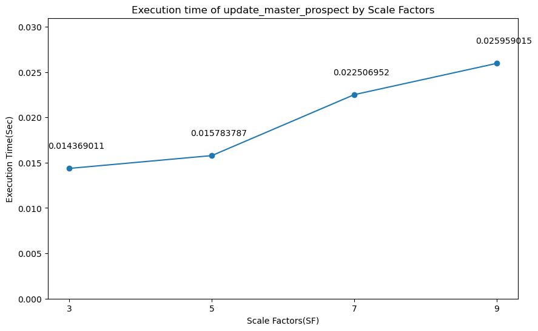
    


```python
import pandas as pd
import matplotlib.pyplot as plt

# read CSV
df = pd.read_csv(r"C:\Users\Jintao1999\Desktop\ULB\data_warehouse\TPC-DI\result\results.csv")


plt.figure(figsize=(10, 6))
plt.plot(df['sf'], df['transform_load_master_dimaccount'], marker='o') # column of csv

# add lable
for x, y in zip(df['sf'], df['transform_load_master_dimaccount']):
    plt.text(x+0.1, y+0.002, str(y), va='bottom', ha='center')


# draw x and y
plt.xlabel('Scale Factors(SF)')
plt.ylabel('Execution Time(Sec)')
# just show the value of sf
plt.xticks(df['sf'])
# add titles
plt.title('Execution time of transform_load_master_dimaccount by Scale Factors')

#plt.xlim(0, max(df['convert_customermgmt_xml_to_csv']) + 1) 
plt.ylim(0, max(df['transform_load_master_dimaccount']) + 0.005) 


plt.show()

```


    
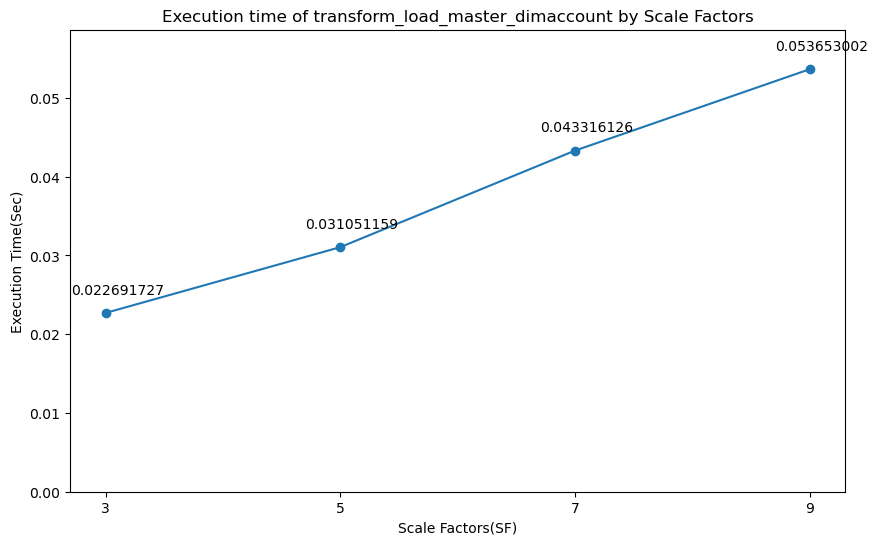
    


```python
import pandas as pd
import matplotlib.pyplot as plt

# read CSV
df = pd.read_csv(r"C:\Users\Jintao1999\Desktop\ULB\data_warehouse\TPC-DI\result\results.csv")

plt.figure(figsize=(10, 6))
plt.bar(df['sf'], df['transform_load_master_dimaccount'], color='skyblue')  # Changed to bar chart

# add label
for x, y in zip(df['sf'], df['transform_load_master_dimaccount']):
    plt.text(x, y, str(y), va='bottom', ha='center')

# draw x and y axes labels
plt.xlabel('Scale Factors(SF)')
plt.ylabel('Execution Time(Sec)')

# just show the value of sf on x-axis
plt.xticks(df['sf'])

# add title
plt.title('Execution time of transform_load_master_dimaccount by Scale Factors')

# set y-axis limit
plt.ylim(0, max(df['transform_load_master_dimaccount']) + 0.005) 

plt.show()

```


    
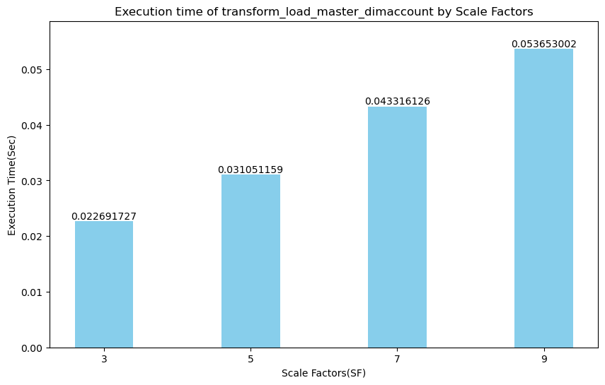
    


```python
import pandas as pd
import matplotlib.pyplot as plt

# read CSV
df = pd.read_csv(r"C:\Users\Jintao1999\Desktop\ULB\data_warehouse\TPC-DI\result\results.csv")


plt.figure(figsize=(10, 6))
plt.plot(df['sf'], df['transform_load_master_dimsecurity'], marker='o') # column of csv

# add lable
for x, y in zip(df['sf'], df['transform_load_master_dimsecurity']):
    plt.text(x+0.1, y+0.01, str(y), va='bottom', ha='center')


# draw x and y
plt.xlabel('Scale Factors(SF)')
plt.ylabel('Execution Time(Sec)')
# just show the value of sf
plt.xticks(df['sf'])
# add titles
plt.title('Execution time of transform_load_master_dimsecurity by Scale Factors')

#plt.xlim(0, max(df['convert_customermgmt_xml_to_csv']) + 1) 
plt.ylim(0, max(df['transform_load_master_dimsecurity']) + 0.1) 


plt.show()

```


    
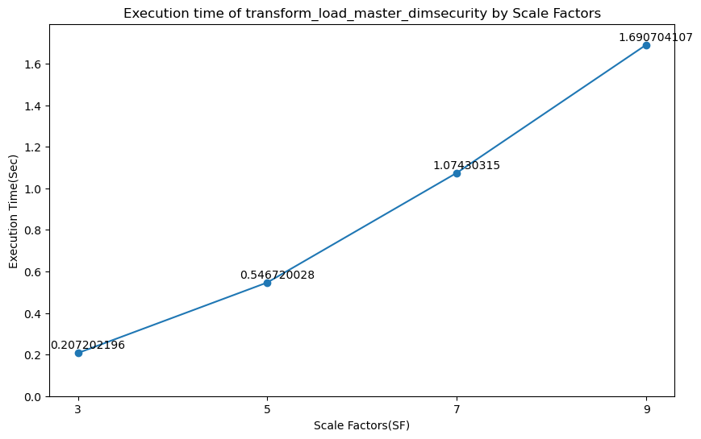
    


```python
import pandas as pd
import matplotlib.pyplot as plt

# read CSV
df = pd.read_csv(r"C:\Users\Jintao1999\Desktop\ULB\data_warehouse\TPC-DI\result\results.csv")


plt.figure(figsize=(10, 6))
plt.plot(df['sf'], df['transform_load_master_dimtrade'], marker='o') # column of csv

# add lable
for x, y in zip(df['sf'], df['transform_load_master_dimtrade']):
    plt.text(x+0.1, y+0.11, str(y), va='bottom', ha='center')


# draw x and y
plt.xlabel('Scale Factors(SF)')
plt.ylabel('Execution Time(Sec)')
# just show the value of sf
plt.xticks(df['sf'])
# add titles
plt.title('Execution time of transform_load_master_dimtrade by Scale Factors')

#plt.xlim(0, max(df['convert_customermgmt_xml_to_csv']) + 1) 
plt.ylim(0, max(df['transform_load_master_dimtrade']) + 1) 


plt.show()

```


    
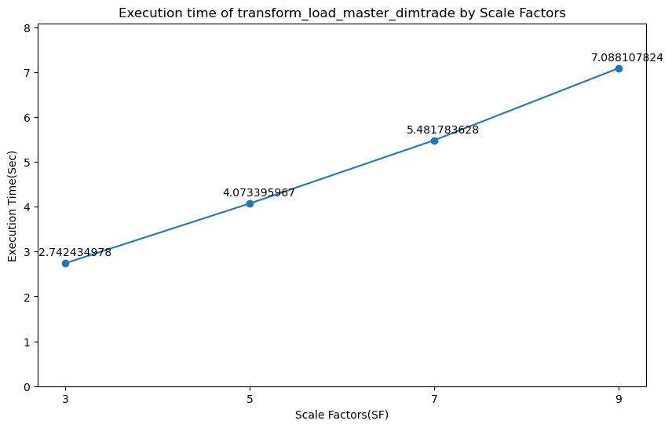
    


```python
import pandas as pd
import matplotlib.pyplot as plt

# read CSV
df = pd.read_csv(r"C:\Users\Jintao1999\Desktop\ULB\data_warehouse\TPC-DI\result\results.csv")

plt.figure(figsize=(10, 6))
plt.bar(df['sf'], df['transform_load_master_dimtrade'], color='skyblue')  # Changed to bar chart

# add label
for x, y in zip(df['sf'], df['transform_load_master_dimtrade']):
    plt.text(x, y, str(y), va='bottom', ha='center')

# draw x and y axes labels
plt.xlabel('Scale Factors(SF)')
plt.ylabel('Execution Time(Sec)')

# just show the value of sf on x-axis
plt.xticks(df['sf'])

# add title
plt.title('Execution time of transform_load_master_dimtrade by Scale Factors')

# set y-axis limit
plt.ylim(0, max(df['transform_load_master_dimtrade']) + 0.5) 

plt.show()

```


    
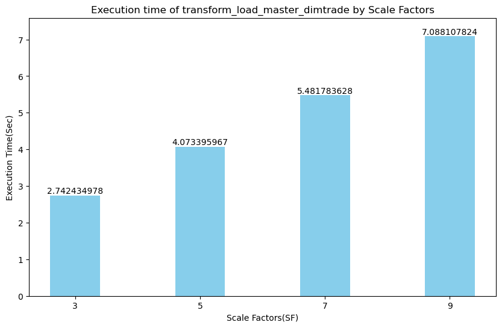
    


```python
import pandas as pd
import matplotlib.pyplot as plt

# read CSV
df = pd.read_csv(r"C:\Users\Jintao1999\Desktop\ULB\data_warehouse\TPC-DI\result\results.csv")


plt.figure(figsize=(10, 6))
plt.plot(df['sf'], df['load_master_dimessages_dimtrade'], marker='o') # column of csv

# add lable
for x, y in zip(df['sf'], df['load_master_dimessages_dimtrade']):
    plt.text(x+0.1, y+0.001, str(y), va='bottom', ha='center')


# draw x and y
plt.xlabel('Scale Factors(SF)')
plt.ylabel('Execution Time(Sec)')
# just show the value of sf
plt.xticks(df['sf'])
# add titles
plt.title('Execution time of load_master_dimessages_dimtrade by Scale Factors')

#plt.xlim(0, max(df['convert_customermgmt_xml_to_csv']) + 1) 
plt.ylim(0, max(df['load_master_dimessages_dimtrade']) + 0.01) 


plt.show()

```


    
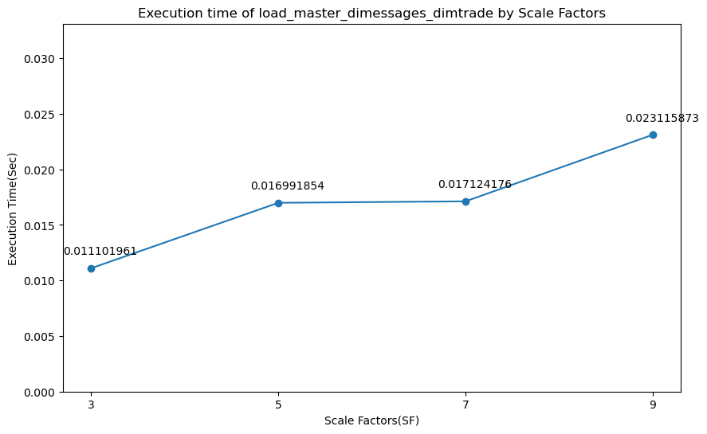
    


```python
import pandas as pd
import matplotlib.pyplot as plt

# read CSV
df = pd.read_csv(r"C:\Users\Jintao1999\Desktop\ULB\data_warehouse\TPC-DI\result\results.csv")


plt.figure(figsize=(10, 6))
plt.plot(df['sf'], df['transform_load_master_financial'], marker='o') # column of csv

# add lable
for x, y in zip(df['sf'], df['transform_load_master_financial']):
    plt.text(x+0.1, y+0.1, str(y), va='bottom', ha='center')


# draw x and y
plt.xlabel('Scale Factors(SF)')
plt.ylabel('Execution Time(Sec)')
# just show the value of sf
plt.xticks(df['sf'])
# add titles
plt.title('Execution time of transform_load_master_financial by Scale Factors')

#plt.xlim(0, max(df['convert_customermgmt_xml_to_csv']) + 1) 
plt.ylim(0, max(df['transform_load_master_financial']) + 1) 


plt.show()

```


    
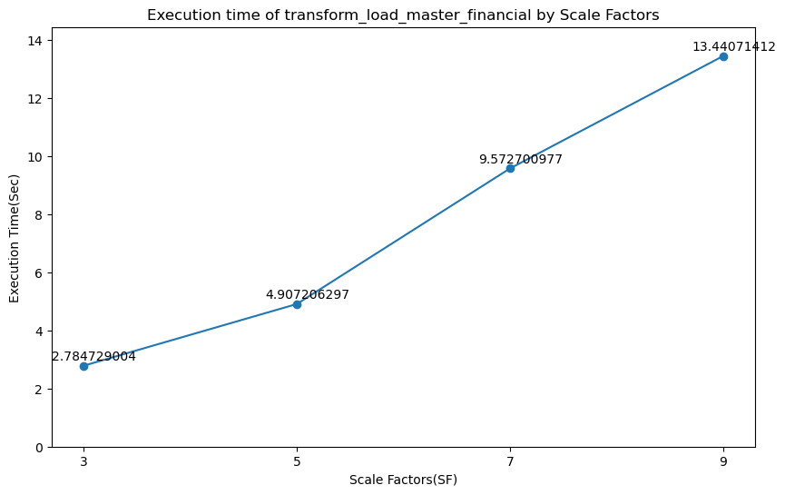
    


```python
import pandas as pd
import matplotlib.pyplot as plt

# read CSV
df = pd.read_csv(r"C:\Users\Jintao1999\Desktop\ULB\data_warehouse\TPC-DI\result\results.csv")


plt.figure(figsize=(10, 6))
plt.plot(df['sf'], df['transform_load_master_factcashbalances'], marker='o') # column of csv

# add lable
for x, y in zip(df['sf'], df['transform_load_master_factcashbalances']):
    plt.text(x+0.1, y+0.01, str(y), va='bottom', ha='center')


# draw x and y
plt.xlabel('Scale Factors(SF)')
plt.ylabel('Execution Time(Sec)')
# just show the value of sf
plt.xticks(df['sf'])
# add titles
plt.title('Execution time of transform_load_master_factcashbalances by Scale Factors')

#plt.xlim(0, max(df['convert_customermgmt_xml_to_csv']) + 1) 
plt.ylim(0, max(df['transform_load_master_factcashbalances']) + 0.03) 


plt.show()

```


    
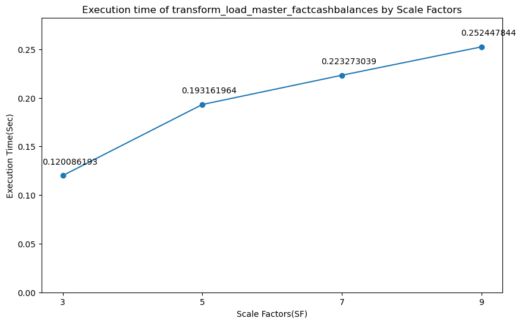
    


```python
import pandas as pd
import matplotlib.pyplot as plt

# read CSV
df = pd.read_csv(r"C:\Users\Jintao1999\Desktop\ULB\data_warehouse\TPC-DI\result\results.csv")


plt.figure(figsize=(10, 6))
plt.plot(df['sf'], df['transform_load_master_factholdings'], marker='o') # column of csv

# add lable
for x, y in zip(df['sf'], df['transform_load_master_factholdings']):
    plt.text(x+0.1, y+0.01, str(y), va='bottom', ha='center')


# draw x and y
plt.xlabel('Scale Factors(SF)')
plt.ylabel('Execution Time(Sec)')
# just show the value of sf
plt.xticks(df['sf'])
# add titles
plt.title('Execution time of transform_load_master_factholdings by Scale Factors')

#plt.xlim(0, max(df['convert_customermgmt_xml_to_csv']) + 1) 
plt.ylim(0, max(df['transform_load_master_factholdings']) + 0.03) 


plt.show()

```


    
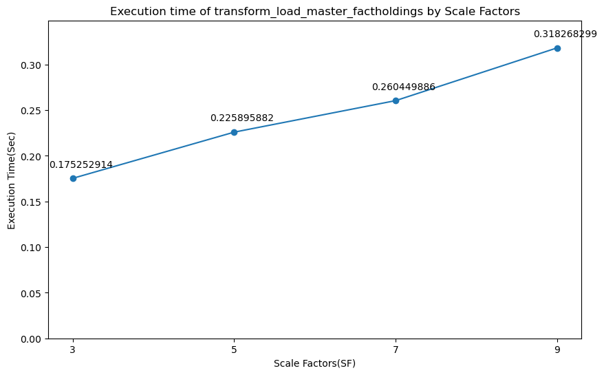
    


```python
import pandas as pd
import matplotlib.pyplot as plt

# read CSV
df = pd.read_csv(r"C:\Users\Jintao1999\Desktop\ULB\data_warehouse\TPC-DI\result\results.csv")


plt.figure(figsize=(10, 6))
plt.plot(df['sf'], df['transform_load_master_factwatches'], marker='o') # column of csv

# add lable
for x, y in zip(df['sf'], df['transform_load_master_factwatches']):
    plt.text(x+0.1, y+0.01, str(y), va='bottom', ha='center')


# draw x and y
plt.xlabel('Scale Factors(SF)')
plt.ylabel('Execution Time(Sec)')
# just show the value of sf
plt.xticks(df['sf'])
# add titles
plt.title('Execution time of transform_load_master_factwatches by Scale Factors')

#plt.xlim(0, max(df['convert_customermgmt_xml_to_csv']) + 1) 
plt.ylim(0, max(df['transform_load_master_factwatches']) + 0.03) 


plt.show()

```


    
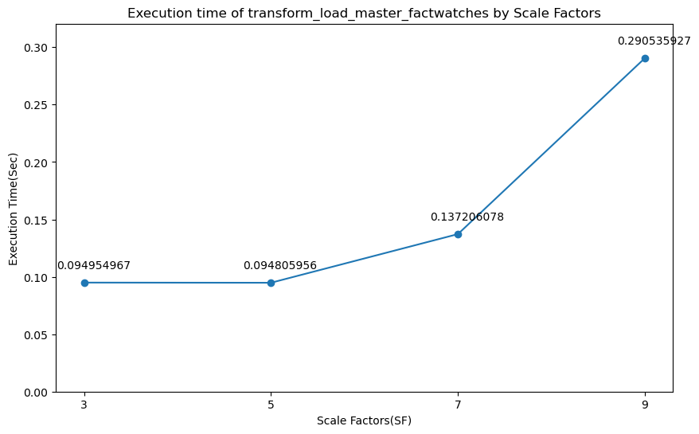
    


```python
import pandas as pd
import matplotlib.pyplot as plt

# read CSV
df = pd.read_csv(r"C:\Users\Jintao1999\Desktop\ULB\data_warehouse\TPC-DI\result\results.csv")


plt.figure(figsize=(10, 6))
plt.plot(df['sf'], df['transform_load_master_factmarkethistory'], marker='o') # column of csv

# add lable
for x, y in zip(df['sf'], df['transform_load_master_factmarkethistory']):
    plt.text(x+0.1, y+0.1, str(y), va='bottom', ha='center')


# draw x and y
plt.xlabel('Scale Factors(SF)')
plt.ylabel('Execution Time(Sec)')
# just show the value of sf
plt.xticks(df['sf'])
# add titles
plt.title('Execution time of transform_load_master_factmarkethistory by Scale Factors')

#plt.xlim(0, max(df['convert_customermgmt_xml_to_csv']) + 1) 
plt.ylim(0, max(df['transform_load_master_factmarkethistory']) + 0.3) 


plt.show()

```


    
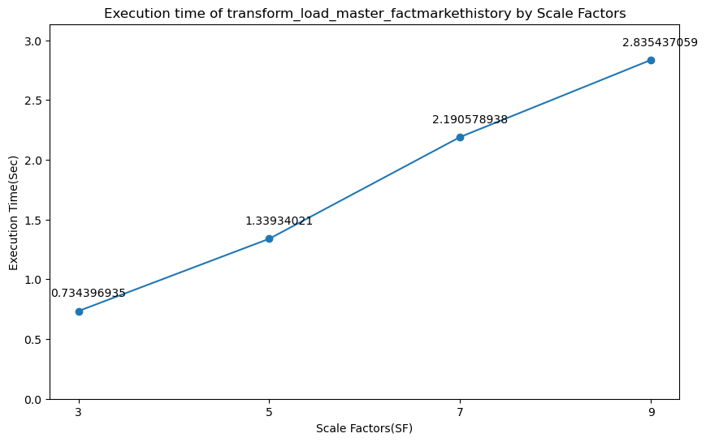
    


```python
import pandas as pd
import matplotlib.pyplot as plt

# read CSV
df = pd.read_csv(r"C:\Users\Jintao1999\Desktop\ULB\data_warehouse\TPC-DI\result\results.csv")


plt.figure(figsize=(10, 6))
plt.plot(df['sf'], df['load_master_dimessages_factmarkethistory'], marker='o') # column of csv

# add lable
for x, y in zip(df['sf'], df['load_master_dimessages_factmarkethistory']):
    plt.text(x+0.1, y+0.0001, str(y), va='bottom', ha='center')


# draw x and y
plt.xlabel('Scale Factors(SF)')
plt.ylabel('Execution Time(Sec)')
# just show the value of sf
plt.xticks(df['sf'])
# add titles
plt.title('Execution time of load_master_dimessages_factmarkethistory by Scale Factors')

#plt.xlim(0, max(df['convert_customermgmt_xml_to_csv']) + 1) 
plt.ylim(0, max(df['load_master_dimessages_factmarkethistory']) + 0.0005) 


plt.show()

```


    
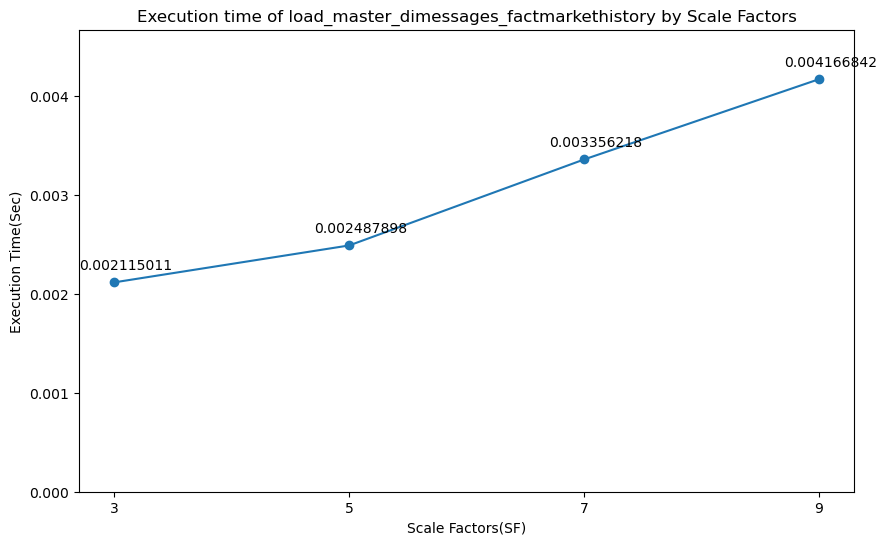
    


```python

```
